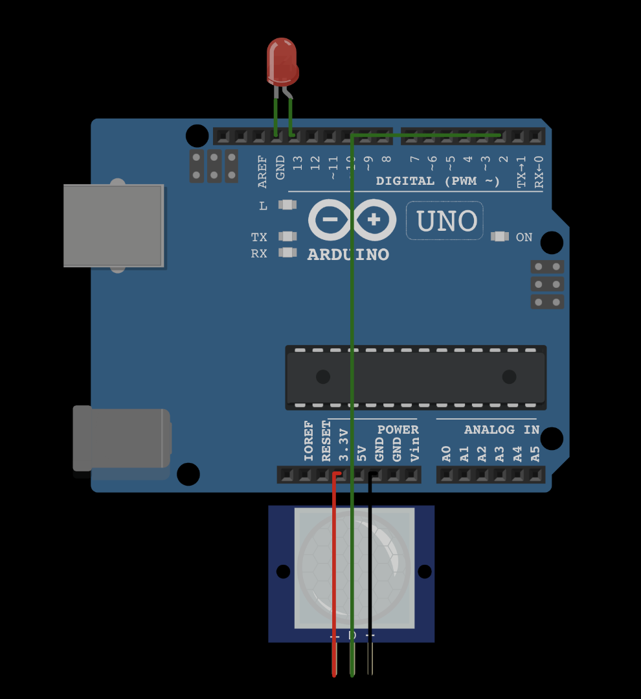

# arduino-action-on-motion-sensor
simple action trigger when motion is detected using MotionSensor  
  
this script is made on [wokwi.com](https://wokwi.com/) and then tested with real life example  

Link to diagram can be found [here](https://wokwi.com/arduino/projects/308619886577320514). Link might be invalid, so you can visit webpage [wokwi.com](https://wokwi.com/) and import this diagram and script yourself  

diagram looks like this  

